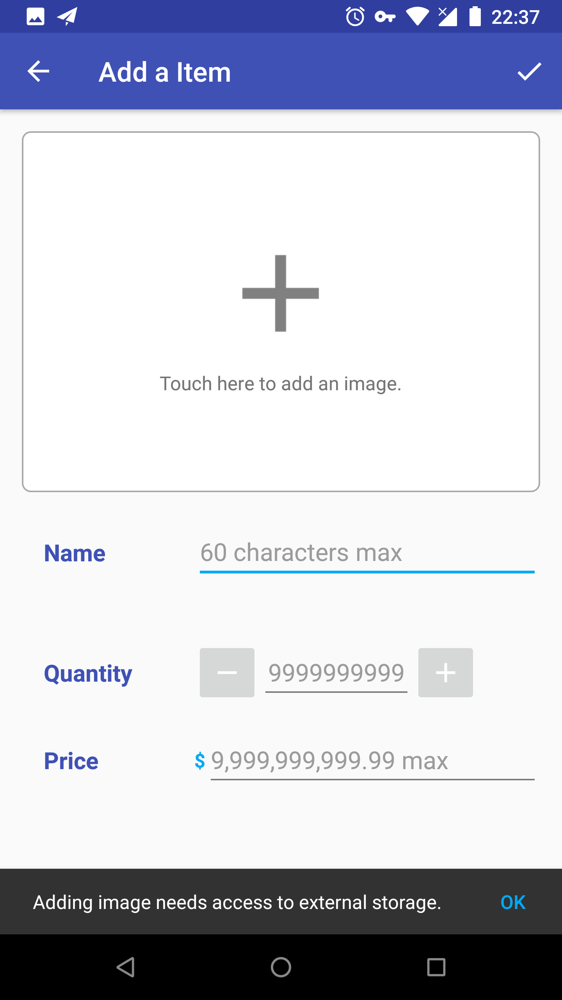

# InventoryApp

An Inventory Management App.

04/01/18: Initiate Commit. (This could be a joke:')

 

1. The initiate page is a blank `CatalogActivity` but a empty view, which tells users that currently "Inventory is empty".
2. When users click the "+" button in AppBar at the top right corner of screen, they will be brought to `DetailActivity` where they input image, name, quantity and price of a item and commit them to `SQLiteDatabase`.
3. When users open `DetailActivity` through the "+" button, the activity will be in ADD mode, the title in AppBar is "Add a Item" and there is only one "Save" button in AppBar.
4. When the edit field (name, quantity and price) is empty, it will display hints, which tell users its maximum input limit. 

 

1. In Android Marshmallow 6.0 (API level 23) and above, when users click the image edit field, Android will popup a system dialog, which asks users for permission to access device's storage; while below API 23, there is no runtime permission request, all the needed permission were granted when the app was installed.
2. If users deny the permission request, there will be a `Toast` saying "Permission was not granted". So users can't take advantage of the function of adding an image to an item.

  

1. After users denied the permission request, if they click the image edit field again, there will be a `Snackbar` which explains why the app needs the permission. 
2. The `Snackbar` will be brought up every time users click the image edit field until users click the "OK" button in the `Snackbar` and click the "ALLOW" button in the system permission dialog to approve the request, or users check the "Don't ask again" box and deny the permission request. However, as long as users leave the image edit field alone, there will be no permission request any more, users just lost the function of adding an image to an item.
3. Therefore, if users don't add an image to the item, the app will add a "no image provided" tag image to that item and save its URI to the database.

 

1. If the permission is granted, a custom `DialogFragment` will popup, which gives users two options: take a photo with camera app or select a picture in gallery. 
2. In Android Marshmallow 6.0 (API level 23) and above, when one of the two image chooser options is pressed, its icon and text will be tinted to `colorAccent`; while below API 23, only ripple effect when clicked.

1. After users take a photo in camera or select a picture in gallery, the image will display in the image edit field by `Glide`. Behind the scene, photo captured by camera will be stored in the public directory because Android Document suggests that photos that user captures with the device camera should be accessible by all apps; while picture selected from gallery will be copied to a storage directory, which remain private to the app only. If users continually choose multiple images, such as taking photos with camera more than one time or select pictures from gallery twice, the app will delete all the previous unwanted images.
2. In the name edit field, users can input any characters up to 60 including emojis. However, if users enter all blank spaces or line breaks, the app will recognise them and tells users these are invalid data. Texts may be displayed in three lines at most and when there are more than three lines contents, the `EditText` become scrollable.
3. In the quantity edit field, users can only input digits from 0 to 9,  no negative sign or decimal point or blank space allowed. The maximum number is set to 9,999,999,999. On the both side of the quantity edit field, there are `ImageButton` used to plus or minus one to quantity until quantity reach the maximum number or zero.
4. In the price edit field, users can only input digits that match the pattern of the "Money" `RegEx` set in a custom `InputFilter`. The maximum number is set to 9,999,999,999.99.

 

1. When users finish their edit, they can click the "Save" button in AppBar at the top right corner of screen to save the item into `SQLiteDatabase`. If data insertion is successful, users will be brought back to `CatalogActivity` from `DetailActivity` and be prompted a `Toast` message, and more importantly, the saved item will be displayed in a two-column staggered `RecyclerView` list.
2. However, if users click UP or BACK button with any non-empty edit fields, a `AlertDialog` will popup and let users decide keep editing or discard the edit. The dialog will also be effective when users make any changes to an existing item in `DetailActivity`'s EDIT mode.

1. The item in the list displays its image, name, price, sold number and remaining number. In particular, the price will be formatted properly with a dollar sign and two decimal places.
2. By default, the sold number is zero when the item is newly added; while the remaining number is set in the quantity edit field in `DetailActivity`. There is a sell `FloatingActionButton` in each item which add one to  the sold number and minus one to the remaining number to the database until the remaining number reach zero and at that time, there will be a `Toast` message says "This item is out of stock".

 

1. When users click one of the item in the list, they will be brought to `DetailActivity` with all the details of the item and display the details in the corresponding edit fields. In this circumstance, the activity will be in EDIT mode, the title in AppBar is "Edit the Item" and there is three buttons in AppBar which are "Order", "Save" and overflow menu "Delete".
2. When users finish their changes, they can click the "Save" button in AppBar at the top right corner of screen to save the changes of the item into the database. If data update is successful, users will be brought back to `CatalogActivity` from `DetailActivity` and be prompted a Toast message. If users did not make any changes, they can click UP or BACK button to return to `CatalogActivity`; but if there are any changes made, a `AlertDialog` will popup and let users decide keep editing or discard the changes.
3. It's worth noting that when users change quantity to a higher number, only the remaining number will be updated while the sold number unchanged; however, if quantity was changed to a lower number, the remaining number will still be updated and the sold number will plus the difference between the previous remaining number and the newly set quantity. 

 

1. In `DetailActivity` EDIT mode, users can click the "Order" button in AppBar when all the data of the item were not changed, otherwise there will be a `Toast` message says "Save the item first".
2. If satisfied, when users click the "Order" button, the app will `Intent` to an email app and compose an email with subject, texts, and an image attachment if the item has an image.

 

In `DetailActivity` EDIT mode, users can click the "Delete the Item" button in the overflow menu in AppBar, and a `AlertDialog` will popup to let users confirm the deletion. If users click the "OK" button in the warning dialog, then the item will be deleted from the database and the app return to `CatalogActivity`.

**A random list in `CatalogActivity` should look like this.**

*Note:*  
In AndroidManifest, `DetailActivity` was set to disable the orientation of the device, in order to prevent app crash like the situation that users holding the device in portrait mode originally but taking photos with camera horizontally, this situation will it unable to go back to the app cause `DetailActivity` was destroyed.  

This is a training project in [Udacity's Android Basics Nanodegree program](https://www.udacity.com/course/android-basics-nanodegree-by-google--nd803).  
Check out this and other courses here: https://www.udacity.com/courses/all